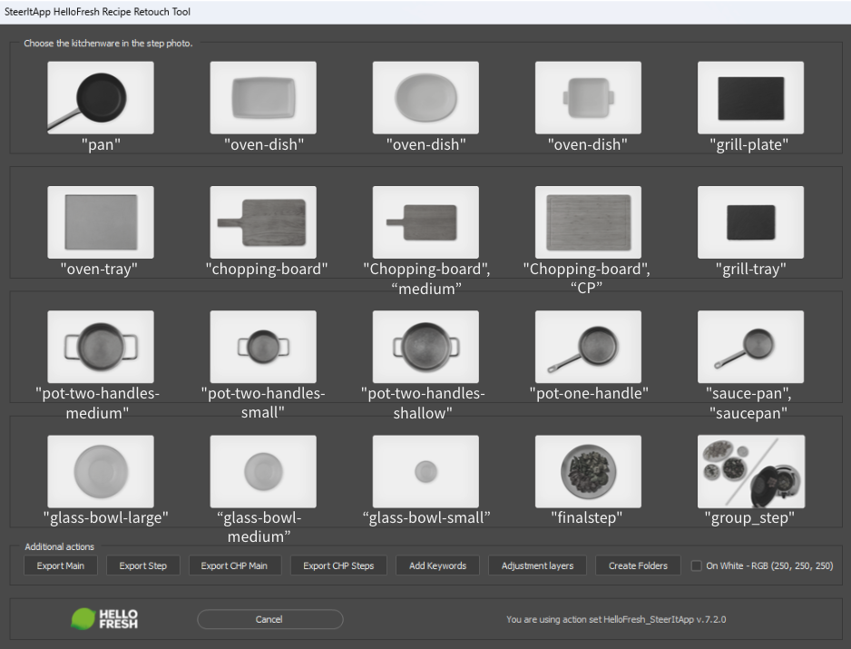
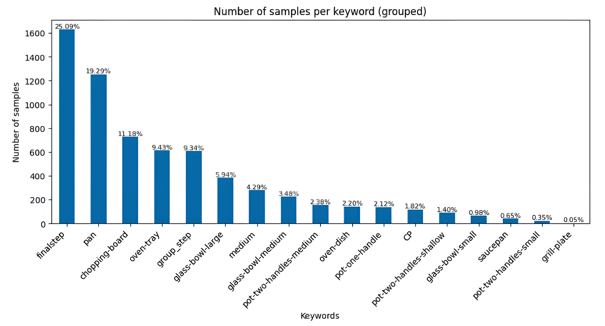
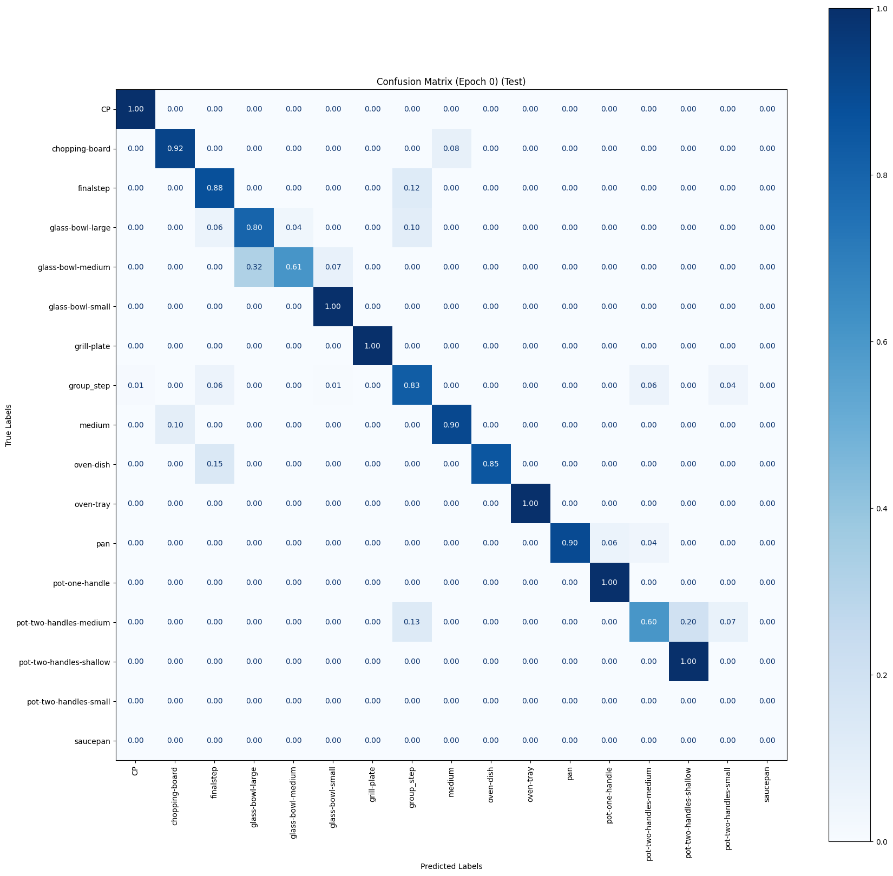
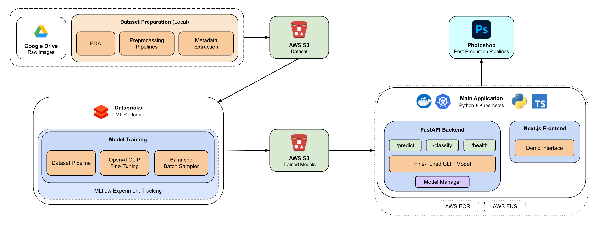

# Recipe Classifier

An ML-powered API that automates the classification of step recipe images. This project consists of a CLIP model fine-tuning pipeline developed on Databricks, dataset preparation pipelines, a production API built with FastAPI, and a demo frontend built with Next.js and TypeScript.

## Overview

**Recipe Classifier** is an image classification project that automates the post-production of step recipe images created at a FoodTech company's Creative Studio. Currently, image categorization is done manually. This project leverages a fine-tuned CLIP model to classify images, automating the first step of the post-production workflow.

By integrating **Recipe Classifier** with **Recipe Cropper** (a separate project developed in parallel), step images are automatically processed without manual intervention. **Recipe Classifier** first categorizes the images and routes them through a specific Photoshop pipeline, after which **Recipe Cropper** generates segmentation masks for background removal. This enables fully automated batch processing in post-production.

This project delivers an API endpoint that integrates with existing Photoshop workflows, automating the classification process previously done manually.

## Results

The production release uses a CLIP model trained on 5,000+ images achieving a macro-average accuracy of 88.5%.

#### Dataset examples:

| Image 
|------------------------|
| 
| **Keyword**: oven-tray


#### Example results:

```
  {
    "keyword": "oven-tray",
    "confidence": 99.98514652252197
  },
  {
    "keyword": "finalstep",
    "confidence": 0.008500693365931511
  },
  {
    "keyword": "group_step",
    "confidence": 0.006036189370206557
  }
```

The model's accuracy varies across different keywords due to the uneven distribution of labels in the dataset.

#### Keywords with examples



#### Keyword Distribution

The chart below shows the keyword distribution after grouping related keywords into the same category:



#### Confusion Matrix

The following confusion matrix visualizes model performance on a test set of 500+ images:



Certain keywords achieve higher classification accuracy than others due to dataset representation. Keywords like `pot-two-handles-small` and `saucepan` are not even present in the evaluation set because they are underrepresented in the overall dataset.


## Project Structure

```
recipe-classifier/
├── databricks/        # CLIP fine-tuning pipelines
│   └── README.md      # Documentation of ML pipelines
├── dataset_prep/      # Dataset preparation tools 
│   └── README.md      # Dataset documentation
├── fastapi-nextjs/    # API and demo frontend
│   ├── demo/          # Next.js frontend
│   └── src/           # FastAPI backend
├── model_dev/         # CLIP exploration and prototyping
│   └── README.md      # Model development documentation
└── utils/             # Utility scripts
```

## Architecture Diagram



## Repository Contents

### ML Pipelines

**Location:** [`databricks/`](databricks)

Contains code for CLIP fine-tuning and dataset preprocessing on Databricks

- Two implementations of CLIP fine-tuning
- Modular architecture for flexible experimentation
- ML pipelines with support for:
    - Balanced batch sampling
    - Grid search hyperparameter optimization
    - MLflow experiment tracking
    - Production-ready inference
- Dataset preprocessing scripts on Databricks
- Detailed documentation in [`databricks/README.md`](databricks/README.md)

The production release uses a model trained on 5,000+ images achieving a macro-average accuracy of 88.5%.

Note: The dataset is imbalanced, with certain keywords appearing more frequently than others. The charts above provide a detailed breakdown of this distribution.

### Dataset Preparation

**Location:** [`dataset_prep/`](dataset_prep)

Tools for preparing and analyzing the recipe image dataset locally:

- Exploratory Data Analysis (EDA)
- Keyword distribution analysis and standarization
- Dataset preprocessing pipeline
- Detailed documentation in [`dataset_prep/README.md`](dataset_prep/README.md)

### FastAPI and Next.js Application

**Location:** [`fastapi_nextjs/`](fastapi_nextjs)

A production-ready API service with demo frontend:

- FastAPI backend that:
    - Provides endpoints for image classification
    - Uses a fine-tuned CLIP model (from OpenAI)
    - Handles image input via direct upload or URL
    - Downloads latest model from S3
- Next.js demo frontend with TypeScript
- Detailed documentation in [`fastapi-nextjs/README.md`](fastapi-nextjs/README.md)

### Model Development

**Location:** [`model_dev/`](model_dev)

Exploration and prototyping of CLIP models for image classification.

- Zero-shot learning capabilities
- Few-shot fine-tuning techniques
- Balanced batch sampling approach
- Example notebooks and datasets
- Detailed documentation in [`model_dev/README.md`](model_dev/README.md)

## API Documentation

### Endpoints

The API provides the following endpoints:

- `/predict` (POST) - Processes and uploaded image file and returns the top 3 classification results with confidence scores
- `/classify` (POST) - Processes an image from a URL provided in a query parameter and returns the top 3 classification results with condifence scores
- `/health` (GET) - Checks the health status of the model

Example:

```
https://recipeclassifier.company.com/api/v1/classify?<image_url>
```
