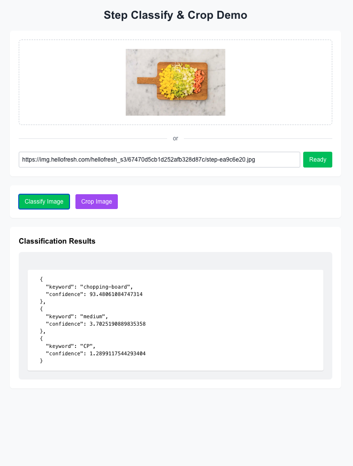
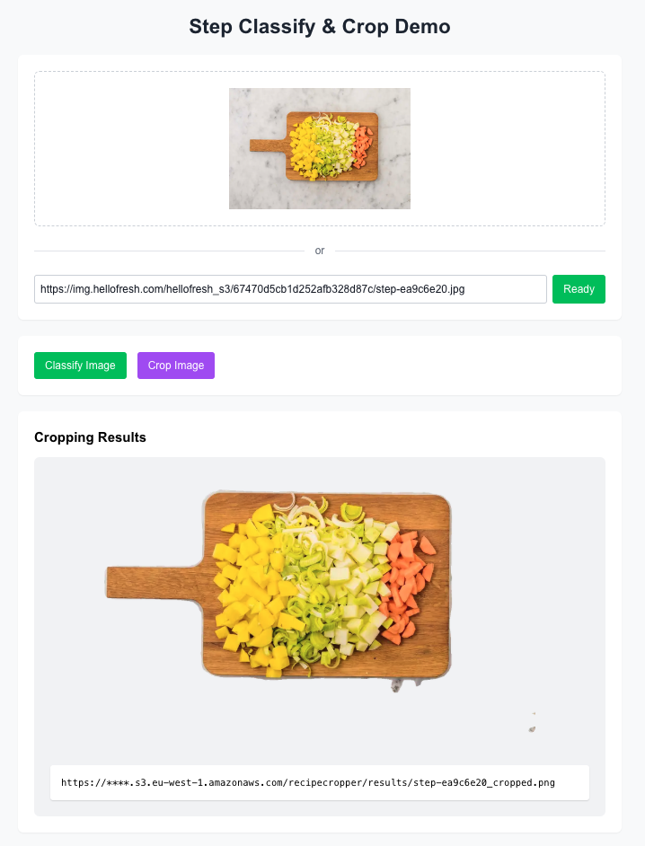

# Step Classify & Crop Demo

A web interface for testing the Recipe Classifier and Recipe Cropper APIs, designed for the Post-Production Team at the Creative Studio.

Built using: Next.js, TypeScript, and Tailwind CSS.

| Classification Screenshot | Cropping Screenshot |
| ----|----|
 | 

## Features

- Test step image classification and cropping
- Preview results directly in the browser
- Two ways to upload images:
    - Direct file upload
    - Image URL input

## How to Run

The demo starts automatically with the main Recipe Classifier application.

For local development: `npm run dev`

