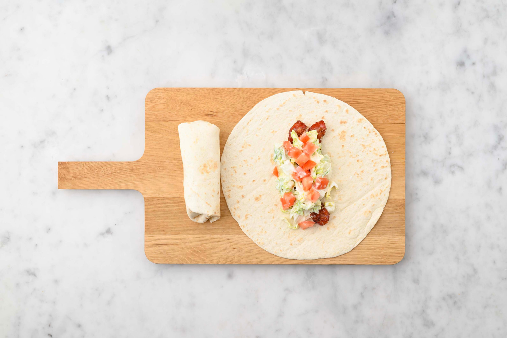
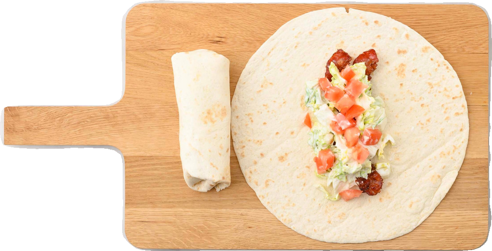
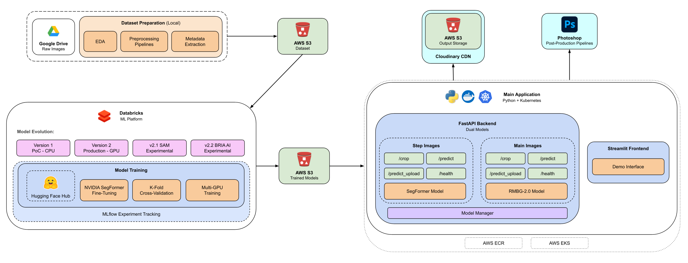

# Recipe Cropper

An ML-powered API that automates background removal from recipe images. This project consists of several segmentation ML pipelines developed on Databricks and deployed with FastAPI, and a demo frontend built with Streamlit.

## Overview

**Recipe Cropper** is an image segmentation project that automates the post-production of step recipe images created at a FoodTech company's Creative Studio. Currently, this process relies on semi-automated Photoshop pipelines that require manual cropping or mask creation for each image. The goal of this project is to fully automate this pipeline.

By integrating **Recipe Cropper** with **Recipe Classifier** (a separate project developed in parallel), step images are automatically processed without manual intervention. **Recipe Classifier** first categorizes the images and routes them through a specific Photoshop pipeline, after which **Recipe Cropper** generates segmentation masks for background removal. This enables fully automated batch processing in post-production.

This project delivers an API endpoint that integrates with existing Photoshop workflows, automating the cropping process previously done manually.

## Results

The production release uses SegFormer model trained on 5,000+ images achieving 0.9464 IoU.

Dataset examples:

| Image | Mask |
|------------|-------------|
|  |  |

Example results:

| Input Image | Cropped Result |
|------------|--------------|
|  |  |


## Project Structure

```
recipe-cropper/
├── databricks/        # ML pipelines
│   └── README.md      # Documentation of ML pipelines
├── fastapi/           # FastAPI application
│   └── README.md      # API documentation
└── streamlit/     
    └── streamlit.py   # Streamlit demo interface
```

## Architecture Diagram



## Repository Contents


### ML Pipelines

**Location:** [`databricks/`](databricks)

Contains code for model development and deployment on Databricks. 

- Multiple versions of the ML implementation, showing the evolution from PoC to Production-ready models
- Support for various model architectures (SegFormer, SAM, BRIA AI)
- ML pipelines with support for:
  - Multi-GPU distributed training
  - K-Fold Cross Validation
  - MLflow experiment tracking
  - Deployment ready with Databricks
- Detailed documentation in [`databricks/README.md`](databricks/README.md)

#### Version History:
  - **Version 1**: Initial proof of concept with CPU training
  - **Version 2**: Production realease with GPU acceleration and improved architecture
  - **Version 2.1**: SAM implementations (experimental)
  - **Version 2.2**: BRIA AI variant (not used in production due to licensing)

The production release uses SegFormer model trained on 5,000+ images achieving 0.9464 IoU.

### FastAPI Application

**Location:** [`fastapi/`](fastapi)

A production-ready API service that:

- Provides endpoints for processing both step and main recipe images
- Supports two segmentation models:
  - **SegFormer** (NVIDIA's mit-b0 model) for step images
  - **RMBG-2.0** (BRIA AI's model) for main images
- Handles image input via direct upload or URL
- Stores processed images in S3
- Downloads latest version of each model from S3
- Detailed documentation in [`fastapi/README.md`](fastapi/README.md)

### Streamlit

**Location:** [`streamlit/`](streamlit)

A Streamlit demo application that provides an easy-to-use interface for testing the model. Supporting image upload or through URL input, and visualization of results.

## API Documentation

### Endpoints

The API provides separate endpoints for **step** and **main** images:

- `{image_type}/predict` (POST) - Processes an image from a URL in the request body and returns the S3 URL of the result
- `{image_type}/predict_upload` (POST) - Processes an uploaded image file and returns the S3 URL of the result
- `/{image_type}/crop` (GET) - Processes an image from a URL provided in a query parameter and redirects to a Cloudinary URL with the result
- `/{image_type}/health` (GET) - Checks the health status of the specific model

Where `{image_type}` should be replaced with either `step` or `main`.

Example:

```
https://recipecropper.company.com/api/v2/step/crop?<image_url>
```
